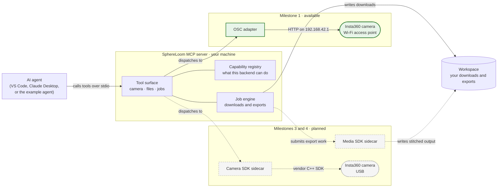

# 🔮 SphereLoom

**An MCP server that lets AI agents control Insta360 cameras and process their 360° media
locally.**

SphereLoom exposes one coherent set of [Model Context Protocol](https://modelcontextprotocol.io)
tools — connect, check status, read and change settings, take photos, record video, browse
the gallery, download media as background jobs — so an AI agent can drive a real camera
safely, and so every unsupported request gets an explained, structured answer instead of a
stack trace.

**Scope, stated plainly:** this project targets **Insta360 cameras**, and development and
testing target the **Insta360 X5**. It is not a generic 360° camera tool. The Wi-Fi layer
speaks the [Open Spherical Camera API](https://developers.google.com/streetview/open-spherical-camera),
which is an open standard, so other OSC cameras may happen to work — but none has been
tested, none is supported, and the USB and media features are built on vendor SDKs that are
Insta360-specific by construction.

> **Status: Milestone 0 complete, Milestone 1 in progress.** The MCP server runs, serves
> tools over stdio, and enforces its configuration and security guard rails. It does not
> talk to a camera yet.

## Why

Automating 360° capture today means juggling a phone app, a desktop stitcher and a folder
of manually copied files. Insta360 publishes real automation surfaces — a Wi-Fi HTTP API
and two desktop C++ SDKs — but they have different capabilities, different platforms and
different access requirements. SphereLoom turns them into a single, typed, agent-friendly
tool surface that is **honest about what each backend can actually do**.

## Capability matrix

This matrix is the project's core promise. Once the capability registry exists it will be
generated from the code, and a test will fail if this table and the code disagree.

| Capability | Status | Notes |
| --- | --- | --- |
| Connect, status, battery, storage | 🟡 Milestone 1 | Over the camera's Wi-Fi access point |
| Read and change capture settings | 🟡 Milestone 1 | Limited to what Insta360's OSC API exposes |
| Take a 360° photo | 🟡 Milestone 1 | Stitched in camera |
| Start / stop video recording | 🟡 Milestone 1 | Output is **unstitched** |
| Browse the gallery with pagination | 🟡 Milestone 1 | |
| Download media as a cancellable job | 🟡 Milestone 1 | Files land in a workspace directory |
| Delete media | 🟡 Milestone 1 | Disabled by default; two-step confirmation |
| Example agent (Microsoft Agent Framework) | 🟡 Milestone 2 | Includes an offline scripted mode |
| `sphereloom-assistant` — one high-level tool like "record 30 seconds and download it" | 🟡 Deferred (after Milestone 2) | Optional extra: `sphereloom[assistant]`. Requires your own model credentials. **Never required by the base server** |
| Exposure / white balance control | 🟡 Milestone 3 | USB only — **not possible over Wi-Fi** |
| Live preview / live stream | 🟡 Milestone 3 | USB only — **not possible over Wi-Fi** |
| Format storage | 🟡 Milestone 3 | USB only; guarded |
| **Export as a stitched 360° video** | 🟡 Milestone 4 | **Does not work before Milestone 4.** Video stitching requires the Insta360 Media SDK, a discrete NVIDIA GPU, and a user-supplied SDK copy |
| Stabilisation, colour grading | 🟡 Milestone 4 | Same requirements as above |
| Trim, cut, merge or edit clips | 🔴 Not planned | Not documented by Insta360, so we do not promise it — and we will not fake it by automating their desktop application |
| DNG → JPG conversion | 🔴 Not supported | Not supported by the Insta360 Media SDK |

Legend: 🟢 available · 🟡 planned for the stated milestone · 🔴 not available.

Every entry above is traced to vendor documentation in the project's internal capability
matrix, and a test fails if this table and the capability registry disagree.

## How it will work



**Legend.** Solid lines and green boxes are implemented or in progress for Milestone 1.
Dashed lines and grey boxes are planned and depend on vendor SDKs you supply yourself.
Rounded boxes are physical cameras; the cylinder is a directory on your disk. Arrows point
in the direction a request travels.

The diagram shows request flow, not deployment: every box except the cameras runs as a
process on your own machine.

- **Ports and adapters.** The agent-facing tools never change when the backend does.
- **Capability registry.** Unsupported operations return
  `{"code": "unsupported", "backend": …, "reason": …, "docs_url": …}` — never a timeout or
  a lie.
- **Jobs, not blocking calls.** Downloads and exports return a `job_id` you poll and can
  cancel. MCP responses carry paths and metadata, never media bytes.
- **Sidecars for vendor C++ SDKs.** They run in their own process, so a native crash cannot
  kill your agent session and our MIT code never links EULA-bound binaries.
- **No LLM inside the server.** The server is deterministic, needs no model credentials to
  start, and costs no tokens to poll. The reasoning lives in your client — which also means
  any MCP client works, not just ours. An optional agent-backed entry point is a separate,
  deferred layer you can ignore entirely.
- **Safe by default.** stdio transport, no network listener, a workspace path jail,
  confirmation tokens for destructive actions, bounded concurrency, redacted logs. HTTP
  access is opt-in and requires a loopback bind plus a token.
- **Testable without hardware.** A protocol-faithful fake camera backend runs the full test
  suite — and doubles as a demo mode, so you can try SphereLoom with no camera at all.

## Planned requirements

- Python 3.12 or 3.13, installed with [`uv`](https://docs.astral.sh/uv/)
- Milestone 1 is pure Python and runs on Windows, Linux and macOS
- An **Insta360 camera** supporting the Open Spherical Camera API. Insta360 lists ONE X,
  ONE X2, ONE R, ONE RS, X3, X4, X4 Air and X5; development and testing target the **X5**
- Milestones 3 and 4 additionally require an Insta360 SDK that **you** obtain and install
  yourself (see [Licensing](#licensing-and-trademarks)); Milestone 4 also requires a
  discrete NVIDIA GPU, and neither SDK supports macOS

## Quick start for contributors

No camera is required.

```bash
git clone https://github.com/jluqueba/sphereloom.git
cd sphereloom
uv venv --python 3.13
uv pip install -e ".[dev]"
```

Run everything CI runs, with one command:

```bash
make check        # Linux and macOS
.\check.ps1       # Windows
```

Confirm the server starts and validate your configuration without launching it:

```bash
uv run --no-sync sphereloom --version
uv run --no-sync sphereloom --check-config
```

To register it with an MCP client, run `sphereloom` over stdio. Configuration is read from
`SPHERELOOM_*` environment variables, every one of which is documented in
[`.env.example`](.env.example).

## Documentation

| Document | What it covers |
| --- | --- |
| [Developer guide](docs/DEVELOPER_GUIDE.md) | Architecture, getting started, project layout, testing, configuration, security model |
| [Contributing](CONTRIBUTING.md) | Branch naming, commit conventions, pull request checklist |
| [Security policy](SECURITY.md) | How to report a vulnerability |
| [Changelog](CHANGELOG.md) | What changed, and when |

Design records — architecture decision records, feature specifications, technical plans and
the product vision — live under `docs/internal/` and are encrypted at rest. You do not need
them to build, test or extend SphereLoom; the developer guide and the instruction files
under `.github/instructions/` carry everything a contributor needs. If a change needs design
context you cannot read, open an issue and ask.

## Contributing

Contributions are welcome, and **you do not need a camera**: the fake backend drives the
entire test suite. Start with [CONTRIBUTING.md](CONTRIBUTING.md) and read the relevant spec
before writing code — this project is spec-driven by design.

Three rules worth knowing up front:

1. Everything in the repository is in **English**.
2. **No GPL-licensed dependencies**, anywhere.
3. **Never commit Insta360 SDK binaries**, and never copy code from Insta360's sample
   repositories — they carry no licence file.

## Licensing and trademarks

SphereLoom is released under the [MIT licence](LICENSE).

The base install (`pip install sphereloom`) pulls in no agent framework and no model
client: the server is deterministic and framework-agnostic by design
(a deliberate, recorded decision). The example
agent and the deferred assistant layer use the Microsoft Agent Framework
(`agent-framework`, MIT licensed), which is an optional extra. GPL-licensed dependencies
are forbidden project-wide.

SphereLoom **does not redistribute any Insta360 SDK**. The Milestone 1 Wi-Fi functionality
uses only Insta360's publicly documented HTTP API and needs no SDK at all. For the USB and
media milestones you apply for the SDK yourself at Insta360's developer portal, accept
their EULA, and point SphereLoom at your local copy with an environment variable.

> Insta360 is a trademark of Arashi Vision Inc. SphereLoom is an independent, unaffiliated
> project and is neither endorsed by, sponsored by, nor associated with Arashi Vision Inc.
> The name "Insta360" is used here only descriptively, to state which cameras this software
> works with.
